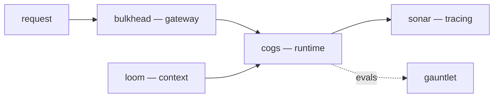

# Bhargava Sai Deepak Mathukumalli

Backend and systems engineer in Bengaluru. I build cloud cost-intelligence and data platforms professionally, and spend my own time implementing LLM-agent infrastructure from the ground up — one small, single-purpose library per hard problem, no framework in the way.

The bias throughout my work: **build the thing to understand it.** Minimal dependencies, code you can read end-to-end in a sitting, and behaviour you can inspect — traces, deterministic replays, real evals rather than vibes.

## An agent platform, built in layers

Instead of reaching for a framework, I've implemented each hard part of running an LLM agent as an independent library. They stand alone, and compose into a complete platform:

| Project | What it solves | Notable internals |
| :-- | :-- | :-- |
| **[cogs](https://github.com/mbsdeepak/cogs)** | The agent runtime | Agent loop, typed tool protocol, provider abstraction, context management, permissions, and deterministic record/replay — ~1.5k lines. |
| **[loom](https://github.com/mbsdeepak/loom)** | Context engineering | Chunking, embeddings, vector retrieval, history compaction, and token-budgeted context assembly. |
| **[bulkhead](https://github.com/mbsdeepak/bulkhead)** | Provider resilience | Retries, circuit breaking, rate limiting, caching, failover, and cost governance in front of any LLM provider. |
| **[gauntlet](https://github.com/mbsdeepak/gauntlet)** | Agentic evaluation | Deterministic simulated tool environments, state/trajectory/LLM-judge grading, and pass@k with Wilson confidence intervals. |
| **[sonar](https://github.com/mbsdeepak/sonar)** | Run observability | OpenTelemetry-style span tracer, cost/latency meters, and text/HTML trace timelines for agent runs. |
| **[qwery](https://github.com/mbsdeepak/qwery)** | SQL over raw files | Hand-written tokenizer and recursive-descent parser feeding a Volcano-model executor over CSV/Parquet — the architecture behind DuckDB and DataFusion, in pure Python. |

## Currently

Working on cloud cost-intelligence — an LLM agent that answers cost questions over petabyte-scale usage data, and the analytics pipelines behind it running on Kubernetes.

**Reach for:** Python · Go · C++ · AWS (Bedrock, Athena) · Kubernetes · Argo · SQL

**Find me:** [github.com/mbsdeepak](https://github.com/mbsdeepak)
<!-- LinkedIn / email: send the handles and I'll wire them in here -->
