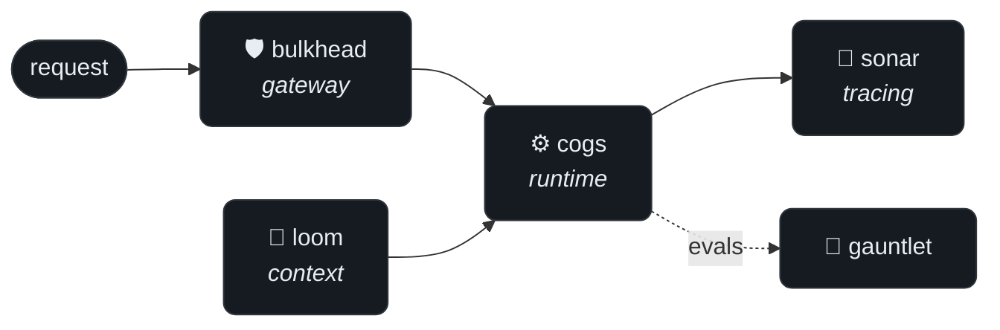

  

 

  I build cloud cost-intelligence and data platforms professionally, and on my own time I implement
  the hard parts from the ground up — LLM-agent infrastructure, data systems, and models — one small,
  single-purpose library per problem, no framework in the way. The bias throughout:
  <b>build the thing to understand it</b> — minimal dependencies, code you can read end-to-end,
  behaviour you can inspect.

 

## ⌁ &nbsp; An agent platform, built in layers

Each hard part of running an LLM agent, implemented as an independent library. They stand alone — and compose into a complete platform.

| Project | What it solves | Notable internals |
| :-- | :-- | :-- |
| **[cogs](https://github.com/mbsdeepak/cogs)** | The agent runtime | Agent loop, typed tool protocol, provider abstraction, context management, permissions, and deterministic record/replay — in ~1.5k lines. |
| **[loom](https://github.com/mbsdeepak/loom)** | Context engineering | Chunking, embeddings, vector retrieval, history compaction, and token-budgeted context assembly. |
| **[bulkhead](https://github.com/mbsdeepak/bulkhead)** | Provider resilience | Retries, circuit breaking, rate limiting, caching, failover, and cost governance in front of any provider. |
| **[gauntlet](https://github.com/mbsdeepak/gauntlet)** | Agentic evaluation | Deterministic simulated tool environments, state/trajectory/LLM-judge grading, and pass@k with Wilson confidence intervals. |
| **[sonar](https://github.com/mbsdeepak/sonar)** | Run observability | OpenTelemetry-style span tracer, cost/latency meters, and text/HTML trace timelines. |

## ⌁ &nbsp; Data & ML, from first principles

The same bias, pointed at data systems and models — each one built to see how the real thing works underneath.

| Project | What it solves | Notable internals |
| :-- | :-- | :-- |
| **[qwery](https://github.com/mbsdeepak/qwery)** | SQL over raw files | Hand-written tokenizer + recursive-descent parser feeding a Volcano-model executor over CSV/Parquet — the design behind DuckDB, in pure Python. |
| **[athena-cost-guard](https://github.com/mbsdeepak/athena-cost-guard)** &nbsp;·&nbsp; [PyPI](https://pypi.org/project/athena-cost-guard/) | Know a query's cost before you run it | Parses SQL with sqlglot, resolves partitions through Glue, and estimates bytes-scanned from S3 — then a `@cost_guard` decorator blocks queries over budget. `pip install athena-cost-guard`. |
| **[kalman-timeseries](https://github.com/mbsdeepak/kalman-timeseries)** | Denoising & forecasting noisy signals | Self-tuning adaptive/robust Kalman filter with an RTS smoother, NumPy-only — ~51% lower error than the plain baseline, with an accompanying paper. |
| **[text-diffusion-fashion-mnist](https://github.com/mbsdeepak/text-diffusion-fashion-mnist)** &nbsp;·&nbsp; [🤗](https://huggingface.co/mbsdeepak/text-diffusion-fashion-mnist) | Text-to-image from scratch | A tiny Stable Diffusion — CLIP text conditioning, a U-Net denoiser, DDIM sampling, and classifier-free guidance, trained on Fashion-MNIST. Weights on Hugging Face. |

## ⌁ &nbsp; Currently

Cloud cost-intelligence — an LLM agent that answers cost questions over large-scale usage data, and the analytics pipelines behind it on Kubernetes.

<b>Reach for:</b> &nbsp; <code>Python</code> &nbsp; <code>Go</code> &nbsp; <code>C++</code> &nbsp; <code>AWS · Bedrock · Athena</code> &nbsp; <code>Kubernetes · Argo</code> &nbsp; <code>SQL</code>

 

  <code>$ contact</code> &nbsp;·&nbsp;
  <a href="https://linkedin.com/in/mbsdeepak"><b>LinkedIn</b></a> &nbsp;·&nbsp;
  <a href="mailto:mbsdeepak3@gmail.com"><b>mbsdeepak3@gmail.com</b></a>

