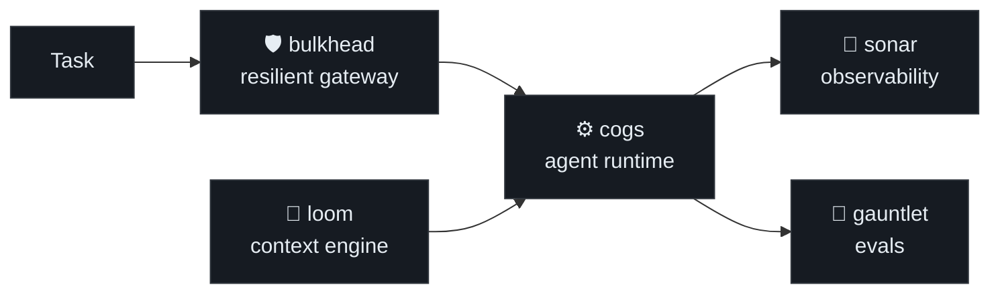

<h1 align="center">Hi, I'm Deepak 👋</h1>

  <b>Software engineer in Bengaluru, building LLM-agent infrastructure from first principles.</b>

  
  
  
  

---

I'm an SDE building cost-intelligence and data-platform systems by day, and a full **LLM-agent stack** by night. Instead of reaching for a framework, I've been building each layer of the agent problem from scratch — small, readable, single-purpose libraries that compose into a complete platform.

## 🧩 The Agent Stack

Six independent libraries, each a few thousand readable lines of Python, that snap together into a working agent platform:

| Repo | What it is |
| :--- | :--- |
| **[cogs](https://github.com/mbsdeepak/cogs)** ⚙️ | A minimal but real **LLM agent runtime** — agent loop, typed tool protocol, provider abstraction, context management, permissions, and deterministic record/replay in ~1.5k lines. |
| **[loom](https://github.com/mbsdeepak/loom)** 🧵 | The **context-engineering layer** — chunking, embeddings, vector retrieval, history compaction, and token-budgeted context assembly. |
| **[bulkhead](https://github.com/mbsdeepak/bulkhead)** 🛡️ | A **resilient LLM gateway** — retries, circuit breaking, rate limiting, caching, failover, and cost governance in front of any provider. |
| **[gauntlet](https://github.com/mbsdeepak/gauntlet)** 🎯 | A rigorous **agentic tool-use eval set** — simulated tool environments, state/trajectory/LLM-judge grading, and pass@k with Wilson confidence intervals. |
| **[sonar](https://github.com/mbsdeepak/sonar)** 📡 | **Observability for agent runs** — an OpenTelemetry-style span tracer, cost/latency meters, and text/HTML trace timelines. |
| **[qwery](https://github.com/mbsdeepak/qwery)** 🔎 | A tiny **SQL query engine** over CSV & Parquet — hand-written tokenizer + recursive-descent parser feeding a Volcano-model executor (à la DuckDB). |

> Same philosophy throughout: **no magic, no heavy frameworks — just readable code that shows how the thing actually works.**

## 🛠️ Tech

  
  
  
  
  
  
  
  

## 📊 GitHub

  
  

## 🤝 Connect

  
  <!-- Add your LinkedIn / blog / email badges here -->

